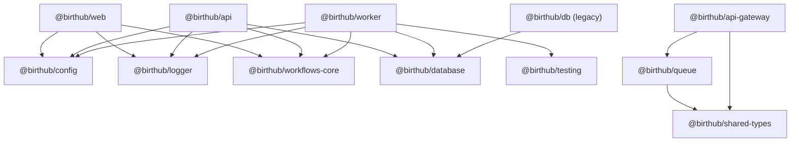

# Internal Package Graph

## Canonical graph

## Notes

- `@birthub/database` é o schema canônico multi-tenant.
- `@birthub/db` permanece como camada de compatibilidade legada e não pode ganhar novos consumidores runtime fora da exceção documentada.
- Dependências internas devem usar `workspace:*` em todos os manifests.
- Mudanças em `package.json` internos exigem atualização do changelog em `docs/release/internal-packages-changelog.md`.
