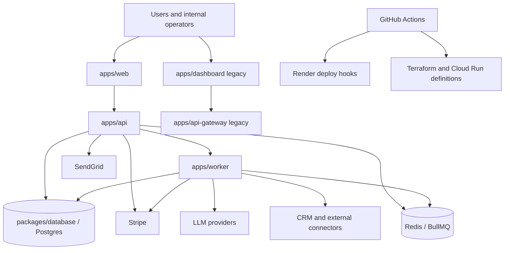
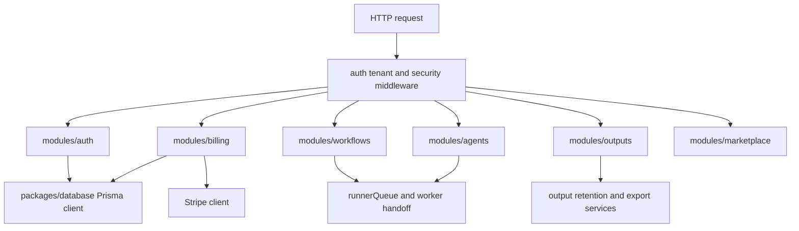

# F10 Architecture and System Documentation

Este documento consolida o que um novo engenheiro precisa para entender o stack canonico, os fluxos criticos e as fronteiras entre dominios.

## Stack canonico suportado

- `apps/web`: frontend canonico e BFF.
- `apps/api`: API oficial de negocio, auth, billing, workflows e marketplace.
- `apps/worker`: execucao assincrona, filas e jobs operacionais.
- `packages/database`: schema Prisma e migrations.
- `packages/*`: contratos, utilitarios, runtime e componentes compartilhados.
- `apps/dashboard`, `apps/api-gateway`, `apps/agent-orchestrator`: superficies legadas de compatibilidade e transicao.

## C4 - Context



## C4 - Container

```mermaid
graph TD
  subgraph Canonical lane
    Web[apps/web]
    Api[apps/api]
    Worker[apps/worker]
    Db[(packages/database)]
    Queue[(Redis queue)]
  end

  subgraph Shared packages
    Config[@birthub/config]
    Logger[@birthub/logger]
    QueuePkg[@birthub/queue]
    AgentsCore[@birthub/agents-core]
    WorkflowsCore[@birthub/workflows-core]
    SharedTypes[@birthub/shared-types]
  end

  Web --> Api
  Api --> Db
  Api --> Queue
  Api --> Config
  Api --> Logger
  Api --> SharedTypes
  Api --> WorkflowsCore
  Worker --> Queue
  Worker --> Db
  Worker --> QueuePkg
  Worker --> AgentsCore
  Worker --> WorkflowsCore
```

## C4 - Component view of the canonical API lane



## API publication and current endpoints

| Surface | OpenAPI artifact | Docs route | Notes |
| --- | --- | --- | --- |
| `apps/api` | `apps/api/src/docs/openapi.ts` | `/api/openapi.json`, `/api/docs` | Canonical business API. Current spec is published and must keep expanding with route coverage. |
| `apps/api-gateway` | `apps/api-gateway/src/docs/openapi.ts` | `/openapi.json`, `/docs` | Legacy compatibility layer. Documented because it remains in controlled sunset. |

## Critical data flows

### Auth

1. `apps/web` sends session and tenant-scoped requests to `apps/api`.
2. `apps/api` applies authentication, tenant context and RBAC guards.
3. Session, membership and audit events are persisted through `packages/database`.
4. Sensitive auth events emit logs and traces for observability and incident response.

### Billing

1. `apps/web` or internal automations call billing routes in `apps/api`.
2. `apps/api` validates plan, budget and webhook invariants.
3. `apps/api` and `apps/worker` talk to Stripe for checkout, portal, invoices and usage sync.
4. Usage and budget state are stored in Postgres and surfaced back to dashboard modules.

### Agents and marketplace

1. `apps/web` requests pack or agent actions through the canonical API.
2. `apps/api` validates policy, organization and plan constraints.
3. Jobs are enqueued for `apps/worker` when execution or long-running tasks are required.
4. Agent results and outputs flow back through the outputs and notifications modules.

### Worker and asynchronous execution

1. `apps/api` enqueues workflow and agent jobs.
2. `apps/worker` consumes BullMQ jobs, executes connectors, LLM calls and billing exports.
3. Persistent state is written to Postgres; transient queue state stays in Redis.
4. Failures route to alerting, DLQ or retry logic depending on job type.

## Bounded contexts and boundaries

| Context | Owning surface | Boundary rule |
| --- | --- | --- |
| Identity and access | `apps/api/src/modules/auth` | Only canonical auth routes define session and MFA behavior. |
| Billing and monetization | `apps/api/src/modules/billing` | Billing state changes must remain auditable and Stripe-backed. |
| Workflows and orchestration | `apps/api/src/modules/workflows`, `packages/workflows-core`, `apps/worker` | HTTP entrypoint stays in API, execution stays in worker. |
| Agents and marketplace | `apps/api/src/modules/agents`, `packages/agent-packs`, `packages/agents/*` | Manifest governance and execution policy must stay versioned together. |
| Notifications and outputs | `apps/api/src/modules/notifications`, `apps/api/src/modules/outputs`, `packages/emails` | Delivery policies must be separated from workflow logic. |
| Legacy compatibility | `apps/dashboard`, `apps/api-gateway`, `apps/agent-orchestrator` | No new product behavior without RFC and explicit cutover decision. |

## External integrations

| Integration | Used by | Primary purpose | Notes |
| --- | --- | --- | --- |
| Stripe | `apps/api`, `apps/worker` | Checkout, portal, invoices, usage sync | See billing modules and release preflight env checks. |
| SendGrid / email providers | `packages/emails`, notifications modules | Transactional communication | Delivery must respect privacy and notification policy docs. |
| LLM providers | `apps/worker`, runtime packages | Agent execution and extraction | Covered by policy engine and runtime ADRs. |
| Redis / BullMQ | `apps/api`, `apps/worker` | Queueing and async orchestration | Operationally critical for retries and backlog mitigation. |
| Postgres / Prisma | `packages/database`, `apps/api`, `apps/worker` | Source of truth for transactional data | Backups and restore live in runbooks. |
| Render deploy hooks | `.github/workflows/cd.yml` | Current deployment trigger | Active for staging and production workflow automation. |
| GCP / Terraform / Cloud Run | `infra/terraform`, `infra/cloudrun` | Infrastructure definition and target hosting pattern | Maintained as infra source of truth for future or alternate deployment lanes. |

## Infrastructure and configuration map

- App runtime configuration is defined in `.env.example`, `.env.vps.example` and release preflight scripts.
- Infra declarations live in `infra/terraform` and `infra/cloudrun/service.yaml`.
- Operational alerting assets live in `infra/monitoring` and `docs/observability-alerts.md`.
- The current CD trigger path is versioned in `.github/workflows/cd.yml`.

## Dependency graph

- Generated file: `docs/f10/dependency-graph.md`
- Refresh command: `pnpm docs:dependency-graph`

## ADR coverage

- Canonical index: `docs/adrs/INDEX.md`
- Architecture appendix: `docs/architecture/decisions`
