# Dependency Graph

Atualizado automaticamente via `pnpm docs:dependency-graph`.

- Manifestos analisados: 37
- Dependencias internas mapeadas: 46

## Hotspots

| Pacote | Dependencias internas declaradas |
| --- | --- |
| `@birthub/worker` | 6 |
| `@birthub/api` | 5 |
| `orchestrator-worker` | 3 |
| `@birthub/api-gateway` | 3 |
| `@birthub/web` | 3 |
| `@birthub/llm-client` | 3 |
| `ae-agent-worker` | 2 |
| `analista-agent-worker` | 2 |
| `financeiro-agent-worker` | 2 |
| `juridico-agent-worker` | 2 |

## Mermaid

```mermaid
graph TD
  subgraph apps[apps]
    _birthub_api["@birthub/api"]
    _birthub_api_gateway["@birthub/api-gateway"]
    _birthub_dashboard["@birthub/dashboard"]
    _birthub_voice_engine["@birthub/voice-engine"]
    _birthub_web["@birthub/web"]
    _birthub_worker["@birthub/worker"]
    orchestrator_worker["orchestrator-worker"]
  end
  subgraph packages[packages]
    _birthub_agent_packs["@birthub/agent-packs"]
    _birthub_agent_runtime["@birthub/agent-runtime"]
    _birthub_agents_core["@birthub/agents-core"]
    _birthub_agents_registry["@birthub/agents-registry"]
    _birthub_auth["@birthub/auth"]
    _birthub_config["@birthub/config"]
    _birthub_conversation_core["@birthub/conversation-core"]
    _birthub_database["@birthub/database"]
    _birthub_db["@birthub/db"]
    _birthub_emails["@birthub/emails"]
    _birthub_integrations["@birthub/integrations"]
    _birthub_llm_client["@birthub/llm-client"]
    _birthub_logger["@birthub/logger"]
    _birthub_queue["@birthub/queue"]
    _birthub_security["@birthub/security"]
    _birthub_shared["@birthub/shared"]
    _birthub_shared_types["@birthub/shared-types"]
    _birthub_testing["@birthub/testing"]
    _birthub_utils["@birthub/utils"]
    _birthub_workflows_core["@birthub/workflows-core"]
  end
  subgraph agents[agents]
    ae_agent_worker["ae-agent-worker"]
    analista_agent_worker["analista-agent-worker"]
    financeiro_agent_worker["financeiro-agent-worker"]
    juridico_agent_worker["juridico-agent-worker"]
    ldr_agent_worker["ldr-agent-worker"]
    marketing_agent_worker["marketing-agent-worker"]
    pos_venda_agent_worker["pos-venda-agent-worker"]
    sdr_agent_worker["sdr-agent-worker"]
  end
  ae_agent_worker --> _birthub_queue
  ae_agent_worker --> _birthub_shared_types
  analista_agent_worker --> _birthub_queue
  analista_agent_worker --> _birthub_shared_types
  financeiro_agent_worker --> _birthub_queue
  financeiro_agent_worker --> _birthub_shared_types
  juridico_agent_worker --> _birthub_queue
  juridico_agent_worker --> _birthub_shared_types
  ldr_agent_worker --> _birthub_queue
  ldr_agent_worker --> _birthub_shared_types
  marketing_agent_worker --> _birthub_queue
  marketing_agent_worker --> _birthub_shared_types
  pos_venda_agent_worker --> _birthub_queue
  pos_venda_agent_worker --> _birthub_shared_types
  sdr_agent_worker --> _birthub_queue
  sdr_agent_worker --> _birthub_shared_types
  orchestrator_worker --> _birthub_llm_client
  orchestrator_worker --> _birthub_queue
  orchestrator_worker --> _birthub_shared_types
  _birthub_api --> _birthub_agents_core
  _birthub_api --> _birthub_config
  _birthub_api --> _birthub_database
  _birthub_api --> _birthub_logger
  _birthub_api --> _birthub_workflows_core
  _birthub_api_gateway --> _birthub_queue
  _birthub_api_gateway --> _birthub_shared_types
  _birthub_api_gateway --> _birthub_utils
  _birthub_dashboard --> _birthub_database
  _birthub_dashboard --> _birthub_logger
  _birthub_voice_engine --> _birthub_logger
  _birthub_web --> _birthub_config
  _birthub_web --> _birthub_logger
  _birthub_web --> _birthub_workflows_core
  _birthub_worker --> _birthub_agents_core
  _birthub_worker --> _birthub_config
  _birthub_worker --> _birthub_database
  _birthub_worker --> _birthub_logger
  _birthub_worker --> _birthub_testing
  _birthub_worker --> _birthub_workflows_core
  _birthub_agent_packs --> _birthub_agents_core
  _birthub_db --> _birthub_database
  _birthub_llm_client --> _birthub_integrations
  _birthub_llm_client --> _birthub_shared_types
  _birthub_llm_client --> _birthub_utils
  _birthub_queue --> _birthub_shared_types
  _birthub_testing --> _birthub_database
```

## Legend

- `apps/*`: superficies de entrega.
- `packages/*`: contratos e bibliotecas.
- `agents/*`: workers e componentes especializados.
